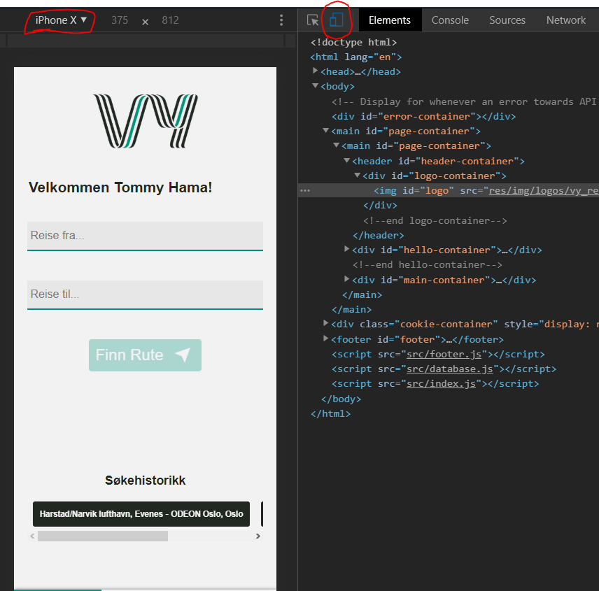

# Vy Door-to-door 

### Group 7 members:
##### Tommy Hamaranses - Front End & Mobile development
##### Krister Pongos Emanuelsen - Front End & Mobile development
##### Andreas Østby - Intelligent Systems
##### Baste Øxseth - Intelligent Systems
##### Jørgen Sølyst - Digital Marketing
##### Frederik Zimmer Wold - Digital Marketing
##### Andreas Sæther - Game Programming
##### Felix Amundsen Zamora - Game Programming

### Scrum Roles

#### Product Owner: Tommy Hamarsnes
#### Scrum Master: Krister Pongos Emanuelsen

## Starting the project locally
Main tools for build up of the application is trough node and yarn

If you do not have node or npm installed, go to this site in order to install it on your computer:
https://nodejs.org/en/download/

The set up for the application is required to only have <b>Yarn</b> installed on your computer.

Link to yarn: https://classic.yarnpkg.com/en/docs/install/#windows-stable

If you don't have it globally installed on the computer you can run the following code in 
your terminal: `npm install yarn -g`

If you do not have npm as recognised command on your computer you must install this first.

IF you have Yarn installed you can run following: `yarn install`

This will install all the needed packages in order to run the server in your browser.

Then run: `yarn start`

Open up a browser and enter following url: <b>localhost:8080</b>

Then follow the <b>Screen guide for phone view</b>
 below 
 
 ## Using the application trough heroku
 Go to the following link and follow the "Screen guide for phone view"
 
 Link: https://vy-reiser.herokuapp.com
 
 
 ## Screen guide for phone view
 First go to the url that you have been given in either the <b>Starting the project locally</b> or 
 <b>Using the application trough heroku</b>.
 
 Then do the following steps:
 1. Right-click on the website (anywhere) and click "Inspect element" ("Inspiser element" ~Norwegian) 
 or CTRL+SHIFT+i on Windows, CMD+ALT+i on MAC.
 
 2. Look for the <b>Iphone & Tablet</b> icon and press it. On the left there should be a drop-down menu where you can toggle 
 between different devices.
 
  
  
  3. And now you are good to go! Search around and have fun!